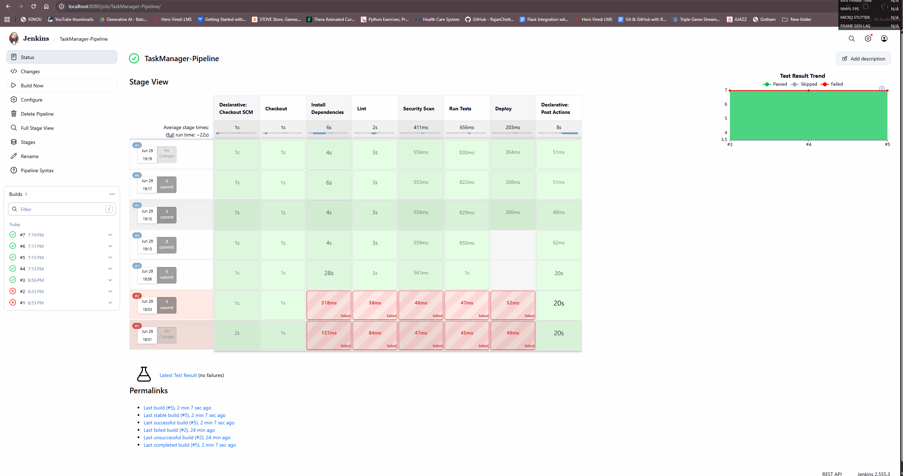
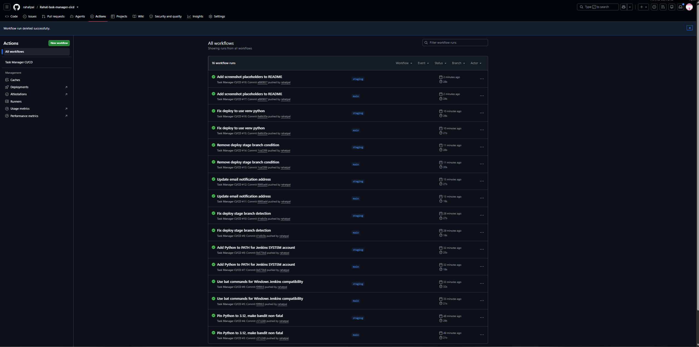
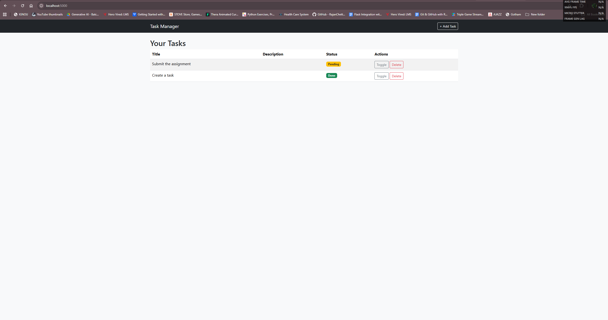

# Task Manager — CI/CD Pipeline Assignment

A Flask-based task management application with two CI/CD pipeline implementations:

1. **Jenkins Pipeline** — automated build, test, and deploy
2. **GitHub Actions** — automated quality checks and deployment

---

## Project Structure

```
├── .github/workflows/ci-cd.yml    GitHub Actions workflow
├── templates/
│   ├── base.html                   Layout template
│   ├── index.html                  Task list page
│   └── add.html                    Add task form
├── app.py                          Flask application (SQLite-backed)
├── test_app.py                     pytest test suite
├── requirements.txt                Python dependencies
├── Jenkinsfile                     Jenkins pipeline definition
├── .gitignore
└── README.md
```

The app stores tasks in a local SQLite database — no external database server required.

---

## Prerequisites

- A **GitHub account**
- A machine (local or VM) to run **Jenkins**
- **Python 3.13+** installed
- Basic familiarity with Git, Flask, and CI/CD concepts

---

## Part 1: Jenkins CI/CD Pipeline

### Step 1 — Create a GitHub Repository

1. Go to https://github.com/new
2. Name it `task-manager-cicd` (or any name you prefer)
3. Do **not** initialize with README (we already have one)
4. Click **Create repository**
5. Follow the instructions to push an existing repository:

```bash
cd E:\HV CI CD Assignment
git init
git add .
git commit -m "Initial commit — Flask task manager with CI/CD"
git branch -M main
git remote add origin https://github.com/<YOUR_USERNAME>/task-manager-cicd.git
git push -u origin main
```

### Step 2 — Install Jenkins

On your **local Windows machine** (no VM needed):

1. Download the Jenkins installer from https://www.jenkins.io/download/#downloading-jenkins
2. Run the installer (Windows Service option)
3. Complete setup at `http://localhost:8080`
4. Get the initial admin password from `C:\ProgramData\Jenkins\.jenkins\secrets\initialAdminPassword`
5. Install suggested plugins

On **Ubuntu VM** (alternative):

```bash
sudo apt update
sudo apt install openjdk-17-jdk -y
curl -fsSL https://pkg.jenkins.io/debian-stable/jenkins.io-2023.key | sudo tee /usr/share/keyrings/jenkins-keyring.asc > /dev/null
echo "deb [signed-by=/usr/share/keyrings/jenkins-keyring.asc] https://pkg.jenkins.io/debian-stable binary/" | sudo tee /etc/apt/sources.list.d/jenkins.list > /dev/null
sudo apt update
sudo apt install jenkins -y
sudo systemctl enable jenkins
sudo systemctl start jenkins
sudo apt install python3 python3-pip python3-venv -y
```

### Step 3 — Install Jenkins Plugins

**Manage Jenkins → Plugins → Available plugins** — install these:

- **Pipeline**
- **Git**
- **GitHub Integration**
- **Email Extension Plugin**
- **Build Timestamp**

### Step 4 — Pipeline Definition (`Jenkinsfile`)

A file named `Jenkinsfile` already exists in the project root. It defines these stages:

| Stage | What it does |
|---|---|
| Checkout | Pulls code from your GitHub repo |
| Install Dependencies | Creates venv, runs `pip install -r requirements.txt` |
| Lint | Runs `pylint` on `app.py` |
| Security Scan | Runs `bandit` security analysis |
| Run Tests | Executes `pytest` with JUnit XML output |
| Deploy | Starts/runs the Flask app on port 5000 (main branch only) |

On failure or success, an email notification is sent.

### Screenshot — Jenkins Pipeline



### Step 5 — Configure the Jenkins Job

1. Jenkins → **New Item** → name: `TaskManager-Pipeline` → **Pipeline** → OK
2. **Pipeline** section:
   - **Definition:** `Pipeline script from SCM`
   - **SCM:** `Git`
   - **Repository URL:** `https://github.com/<YOUR_USERNAME>/task-manager-cicd.git`
   - **Branch:** `*/main`
   - **Script Path:** `Jenkinsfile`
3. **Build Triggers:** check **GitHub hook trigger for GITScm polling**
4. Save

### Step 6 — GitHub Webhook (Auto-Trigger)

1. GitHub repo → **Settings → Webhooks → Add webhook**
2. **Payload URL:** `http://<YOUR_MACHINE_IP>:8080/github-webhook/`
   - If running Jenkins locally, use `http://localhost:8080/github-webhook/`
   - For local dev, you may need a tool like **ngrok** to expose localhost
3. **Content type:** `application/json`
4. **Events:** Just the push event
5. **Add webhook**

### Step 7 — Email Notifications

1. **Manage Jenkins → Configure System → Extended E-mail Notification**
2. SMTP server: `smtp.gmail.com:587`
3. Check **Use TLS**
4. Add your email credentials
5. Set **Default Recipients**
6. Update `your-email@example.com` in the `Jenkinsfile` with your actual email

---

## Part 2: GitHub Actions CI/CD Pipeline

### Step 1 — Create Branches

```bash
git checkout -b staging
git push origin staging
git checkout main
```

### Step 2 — Workflow File

The file `.github/workflows/ci-cd.yml` defines two jobs:

**Job 1: `quality`** (runs on every push/PR)

| Step | Tool |
|---|---|
| Setup Python | `actions/setup-python@v5` |
| Install dependencies | `pip install -r requirements.txt` |
| Lint | `pylint` |
| Security check | `bandit` |
| Format check | `black` (non-blocking) |
| Run tests | `pytest` |

**Job 2: `deploy-staging`** (runs after `quality` on push to `staging`)

**Job 3: `deploy-production`** (runs after `quality` when a release is published)

### Step 3 — Configure GitHub Secrets

Repo → **Settings → Secrets and variables → Actions → New repository secret**

| Secret | Purpose |
|---|---|
| `STAGING_DEPLOY_KEY` | SSH key for staging server |
| `PRODUCTION_DEPLOY_KEY` | SSH key for production server |
| `STAGING_HOST` | Staging server hostname |
| `PRODUCTION_HOST` | Production server hostname |
| `SECRET_KEY` | Flask secret key |

### Step 4 — Workflow Triggers

| Event | Jobs |
|---|---|
| Push to `main` | `quality` |
| Push to `staging` | `quality` → `deploy-staging` |
| Publish a Release | `quality` → `deploy-production` |
| Pull request to `main` | `quality` |

### Screenshot — GitHub Actions



---

## Running Locally

```bash
cd E:\HV CI CD Assignment
python -m venv venv
venv\Scripts\activate        # Windows
# source venv/bin/activate   # Linux/Mac
pip install -r requirements.txt
python app.py
```

Visit **http://localhost:5000**

### Screenshot — Application



## Running Tests

```bash
venv\Scripts\activate
python -m pytest test_app.py -v
```

Expected output:

```
test_app.py::test_home_page_returns_200 PASSED
test_app.py::test_home_page_shows_empty_message PASSED
test_app.py::test_add_task PASSED
test_app.py::test_add_task_page_loads PASSED
test_app.py::test_toggle_task_status PASSED
test_app.py::test_delete_task PASSED
test_app.py::test_multiple_tasks PASSED
```

---

